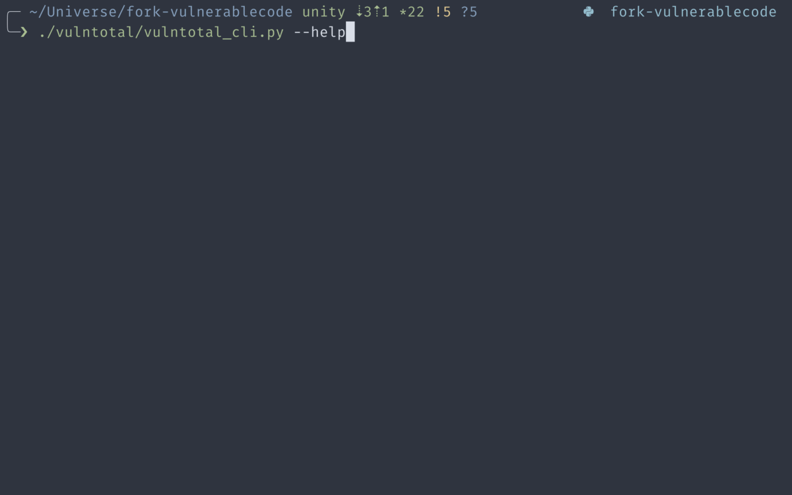

# VulnTotal Browser Extension

> This project is proposed to be part of Google Summer of Code (GSoC) 2024.

> This project implements a browser extension which would run VulnTotal on the client side. This will enable client to query the vulnerability datasources and comparing them.

## Project Description
Currently, VulnTotal, one of AboutCode's projects for cross-validating public vulnerability check tools and data sources, only provides CLI tools that take a PURL argument and return vulnerability data from various data sources. This project aims to expand the usage of VulnTotal by providing a browser extension that runs VulnTotal and allows browser users to query vulnerability data sources and cross-validate them directly on the client side of the browser. This project will deliver an implementation of a browser extension using Python that can run VulnTotal. Python is chosen as the VulnTotal project is implemented using Python, thus the existing project doesn’t need to be rewritten. In addition, this project will also deliver research result of a suitable tool to run Python code in the browser, especially as a browser extension. By developing this project, a better user experience can be provided to cross-validate and check vulnerability data sources.

### VulnTotal Description
VulnTotal cross-validates the vulnerability coverage of publicly available vulnerability check tools and databases. There are scenarios where a package is reported as vulnerable by some tools or databases but not by others, VulnTotal helps in detection such anomaly. We can gradually work with these tool providers to keep each other apprised about newly discovered vulnerabilities and anomaly, making FOSS more secure.

## References
1. Google Summer of Code (GSoC) 2024 Proposal
    - This proposal contains project summary, project description, proposed timeline, and proposed implementation method
    - We can find the proposal here: [GSoC 2024 Proposal AboutCode - VulnerableCode Vulntotal Browser Extension](./docs/Proposal%20AboutCode%20-%20VulnerableCode%20Vulntotal%20Browser%20Extension%20(Category%20B)%20-%20Malik%20Akbar%20Hashemi%20Rafsanjani.pdf)

2. VulnTotal
    - VulnTotal Documentation: [VulnTotal: Tool for cross-validating vulnerability](https://rtd.keshav.space/en/latest/)
    - VulnTotal Codes: [VulnTotal](https://github.com/nexB/vulnerablecode/tree/main/vulntotal)
    - VulnTotal Proposal: [GSoC 2022 Proposal: Cross-Validate vulnerability coverage of VulnerableCode](https://docs.google.com/document/d/1it5eKwIiSsnuKuMAPhP1SoYiq412bdPmuAWNN25ZVAY/edit)
    - VulnTotal Pull Request: [Add Vulntotal CLI](https://github.com/nexB/vulnerablecode/pull/801)

3. Project Implementation
    - Proof of Concept: [Python Web Extension](https://github.com/malikrafsan/python-web-extension)
    - Pyodide Documentation: [Pyodide](https://pyodide.org/en/stable/)
    - PyScript Documentation: [PyScript](https://pyscript.net/)
    - Google Chrome Extensions: [Extensions](https://developer.chrome.com/docs/extensions)

